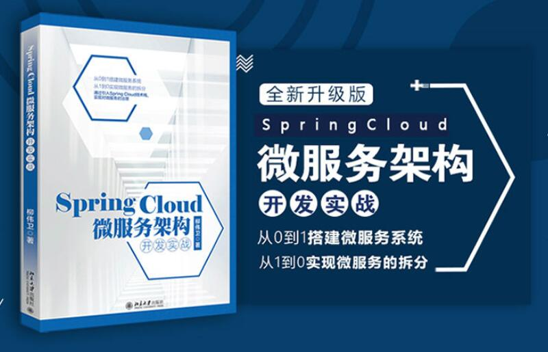

# Spring Cloud Microservices Development.《Spring Cloud 微服务架构开发实战》

## 内容简介

众所周知，Spring Cloud 是开发微服务架构系统的利器，企业对 Spring Cloud 方面的开发需求也非常旺盛。然而，虽然市面上介绍 Spring Cloud 的概念及基础入门的书籍较多，但这些书籍中的案例往往只是停留在简单的“Hello World”级别，缺乏可真正用于实战落地的指导。

本书与其他书籍不同，其中一个最大的特色是真正从实战角度出发，运用 Spring Cloud 技术来构建一个完整的微服务架构的系统。本书全面介绍 Spring Cloud 的概念、产生的背景，以及围绕 Spring Cloud 在开发微服务架构系统过程中所面临的问题时应当考虑的设计原则和解决方案。特别是在设计微服务架构系统时所面临的系统分层、服务测试、服务拆分、服务通信、服务注册、服务发现、服务消费、集中配置、日志管理、容器部署、安全防护、自动扩展等方面，给出了作者自己独特的见解。本书不仅介绍了微服务架构系统的原理、基础理论，还以一个真实的天气预报系统实例为主线，集成市面上主流的最新的实现技术框架，手把手地教读者如何来应用这些技术，创建一个完整的微服务架构系统。这样读者可以理论联系实践，从而让 Spring Cloud 真正地落地。

此外，本书不仅可以令读者了解微服务架构系统开发的完整流程，而且通过实战结合技术点的归纳，令读者知其然且知其所以然。本书所涉及的技术符合当前主流，并富有一定的前瞻性，可以有效提高读者在市场中的核心竞争力。

本书主要面向以 Spring 为核心的 Java EE 开发者，以及对 Spring Cloud 和微服务开发感兴趣的读者。

## 写作背景

对于微服务知识的整理归纳，最早是在笔者的第一本书[《分布式系统常用技术及案例分析》](https://github.com/waylau/distributed-systems-technologies-and-cases-analysis)的微服务章节中，作为微服务的基础理论来展开的。由于篇幅限制，当时书中所涉及的案例深度和广度也比较有限。其后，笔者又在 GitHub 上，以开源方式撰写了[《Spring Boot 教程》](https://github.com/waylau/spring-boot-tutorial)、[《Spring Cloud 教程》](https://github.com/waylau/spring-cloud-tutorial)系列教程，为网友们提供了更加丰富的使用案例。在2017年，笔者应邀给慕课网做了一个关于 [Spring Boot](http://coding.imooc.com/class/125.html)、[Spring Cloud](https://coding.imooc.com/class/177.html) 实战的系列视频课程。视频课程上线后受到广大 Java 技术爱好者的关注，课程的内容也引起了热烈的反响。很多该课程的学员通过学习该课程，不但可以学会 Spring Boot 及 Spring Cloud 最新的周边技术栈，掌握如何运用上述技术进行整合、搭建框架的能力，熟悉单体架构及微服务架构的特点，并且最终实现掌握构建微服务架构的实战能力。最为重要的是提升了学员自身在市场上的价值。

众所周知，Spring Cloud 是开发微服务架构系统的利器，企业对 Spring Cloud 方面的开发需求也非常旺盛。然而，虽然市面上介绍 Spring Cloud 的概念及基础入门的书籍较多，但这些书籍中的案例往往
只是停留在简单的“Hello World”级别，缺乏可真正用于实战落地的指导。于是，笔者打算写一本可以完整呈现 Spring Cloud 实战的书籍。

笔者将以往系列课程中的技术做了总结和归纳，采用目前最新的 Spring Boot 及 Spring Cloud 技术栈（本书案例基于最新的Spring Boot 2.0.0.M4 及Spring Cloud Finchley.M2 编写）来重写了整个教学案例，并整理成书，希望能够弥补 Spring Cloud 在实战方面的空白，从而使广大 Spring Cloud 爱好者都能受益。

## 目录

见全书[目录](SUMMARY.md)。

## 本书所涉及到的技术及相关版本如下

本书所采用的技术及相关版本较新，请读者将相关开发环境设置成跟本书所采用的一致，或者不低于本书的配置。

* JDK 8
* Gradle 4.0
* Spring Boot 2.0.0.M4
* Spring Boot Web Starter 2.0.0.M4
* Apache HttpClient 4.5.3
* Spring Boot Data Redis Starter 2.0.0.M4
* Redis 3.2.100
* Spring Boot Quartz Starter 2.0.0.M4
* Quartz Scheduler 2.3.0
* Spring Boot Thymeleaf Starter 2.0.0.M4
* Thymeleaf 3.0.7.RELEASE
* Bootstrap 4.0.0-beta.2
* Spring Boot 2.0.0.M3
* Spring Cloud Starter Netflix Eureka Server Finchley.M2
* Spring Cloud Starter Netflix Eureka Client Finchley.M2
* Spring Cloud Starter Netflix Ribbon Finchley.M2
* Spring Cloud Starter OpenFeign Finchley.M2
* Spring Cloud Starter Netflix Zuul Finchley.M2
* Docker 17.09.1-ce-win42
* Gradle Docker 0.17.2
* Elasticsearch 6.0
* Logstash 6.0
* Kibana 6.0
* Logback JSON encoder 4.11
* Spring Cloud Config Server Finchley.M2
* Spring Cloud Config Client Finchley.M2
* Spring Cloud Starter Netflix Hystrix Finchley.M2
* Spring Cloud Starter Bus Dalston.SR5
* Erlang/OTP 20.2
* RabbitMQ 3.7.2
* rgrok 2.2.8

另外，本书采用示例采用 Eclipse Oxygen.1a Release (4.7.1a) 来编写，但示例源码与具体的 IDE 无关，读者朋友可以自行选择适合自己的IDE，比如IntelliJ IDEA、NetBeans等。

## 源代码

本书提供源代码下载，地址位于[本项目](https://github.com/waylau/spring-cloud-microservices-development)下的`samples`目录。

## 勘误和交流

本书如有勘误，会在<https://github.com/waylau/spring-cloud-microservices-development/issues>上进行发布。由于笔者能力有限，时间仓促，难免错漏，欢迎读者批评指正。

您也可以上[豆瓣](https://book.douban.com/subject/30192752/)给老卫打Call。

## 联系作者

您也可以直接联系我：

* 博客：https://waylau.com
* 邮箱：[waylau521(at)gmail.com](mailto:waylau521@gmail.com)
* 微博：http://weibo.com/waylau521
* 开源：https://github.com/waylau

## 如何获取本书

实体店及各大网店有售。据我所知有如下网站供应：

* [京东](https://search.jd.com/Search?keyword=%E6%9F%B3%E4%BC%9F%E5%8D%AB%20Spring%20Cloud%20%E5%BE%AE%E6%9C%8D%E5%8A%A1%E6%9E%B6%E6%9E%84%E5%BC%80%E5%8F%91%E5%AE%9E%E6%88%98&enc=utf-8&wq=%E6%9F%B3%E4%BC%9F%E5%8D%AB%20Spring%20Cloud%20%E5%BE%AE%E6%9C%8D%E5%8A%A1%E6%9E%B6%E6%9E%84%E5%BC%80%E5%8F%91%E5%AE%9E%E6%88%98&pvid=640318b62c6b4eea88a5c93038d76f10)
* [1号店](http://search.yhd.com/c0-0/k%25E6%259F%25B3%25E4%25BC%259F%25E5%258D%25AB%2520Spring%2520Cloud%2520%25E5%25BE%25AE%25E6%259C%258D%25E5%258A%25A1%25E6%259E%25B6%25E6%259E%2584%25E5%25BC%2580%25E5%258F%2591%25E5%25AE%259E%25E6%2588%2598/)
* [淘宝](https://s.taobao.com/search?q=%E6%9F%B3%E4%BC%9F%E5%8D%AB+Spring+Cloud+%E5%BE%AE%E6%9C%8D%E5%8A%A1%E6%9E%B6%E6%9E%84%E5%BC%80%E5%8F%91%E5%AE%9E%E6%88%98&imgfile=&commend=all&ssid=s5-e&search_type=item&sourceId=tb.index&spm=a21bo.2017.201856-taobao-item.1&ie=utf8&initiative_id=tbindexz_20170306)
* [当当](http://search.dangdang.com/?key=%C1%F8%CE%B0%CE%C0%20Spring%20Cloud%20%CE%A2%B7%FE%CE%F1%BC%DC%B9%B9%BF%AA%B7%A2%CA%B5%D5%BD&act=input)
* [亚马逊](https://www.amazon.cn/s/ref=nb_sb_noss?__mk_zh_CN=%E4%BA%9A%E9%A9%AC%E9%80%8A%E7%BD%91%E7%AB%99&url=search-alias%3Daps&field-keywords=%E6%9F%B3%E4%BC%9F%E5%8D%AB+Spring+Cloud+%E5%BE%AE%E6%9C%8D%E5%8A%A1%E6%9E%B6%E6%9E%84%E5%BC%80%E5%8F%91%E5%AE%9E%E6%88%98)

也可以直接关注我博客（<https://waylau.com>）或者我的开源书（<https://waylau.com/books>）。

## 其他书籍

若您对本书不感冒，笔者还写了其他方面的超过一打的书籍（可见<https://waylau.com/books/>），多是开源电子书。

本人也维护了一个[books-collection](https://github.com/waylau/books-collection)项目，里面提供了优质的专门给程序员的开源、免费图书集合。

## 开源捐赠

捐赠所得所有款项将用于开源事业！见[捐赠列表](https://waylau.com/donate)。

